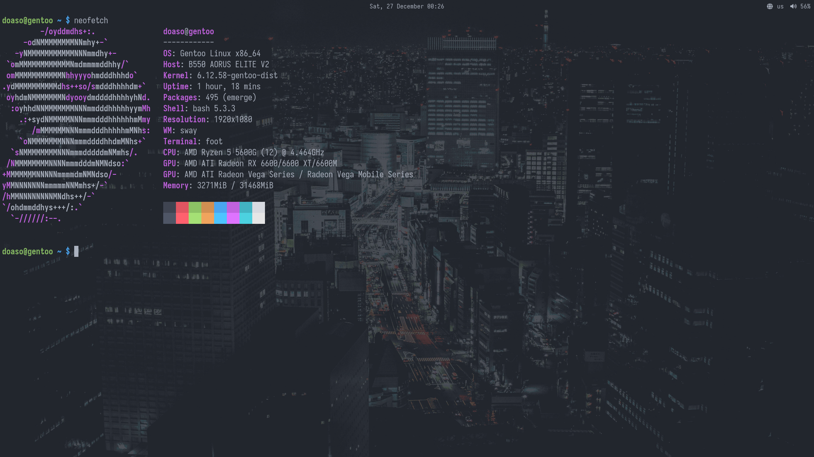

## 📦 Installation
```sh
git clone https://github.com/doaso/dotfiles.git
cd dotfiles/
bash install.sh
```
> **❗ Edit the following files before running the script: `./root/install.sh`, `./root/etc/env.d/00local`, `./root/etc/portage/make.conf`**
## 👏 Credits
* The Ellen Joe cursor theme was created by [乱涂乱画BEN](https://ko-fi.com/bentu404) and adapted for Linux by [PXRYZL](https://www.opencode.net/pxryzl). All information about the license and source can be found [here](https://www.gnome-look.org/p/2166863).
* The wallpaper od_tokyo was created by [Narmis-E](https://github.com/Narmis-E). All information about the license and source can be found [here](https://github.com/Narmis-E/onedark-wallpapers/blob/main/misc/od_tokyo.jpg).
* Font IosevkaNerdFont. All information about the license and source can be found [here](https://github.com/ryanoasis/nerd-fonts/tree/master/patched-fonts/Iosevka).
